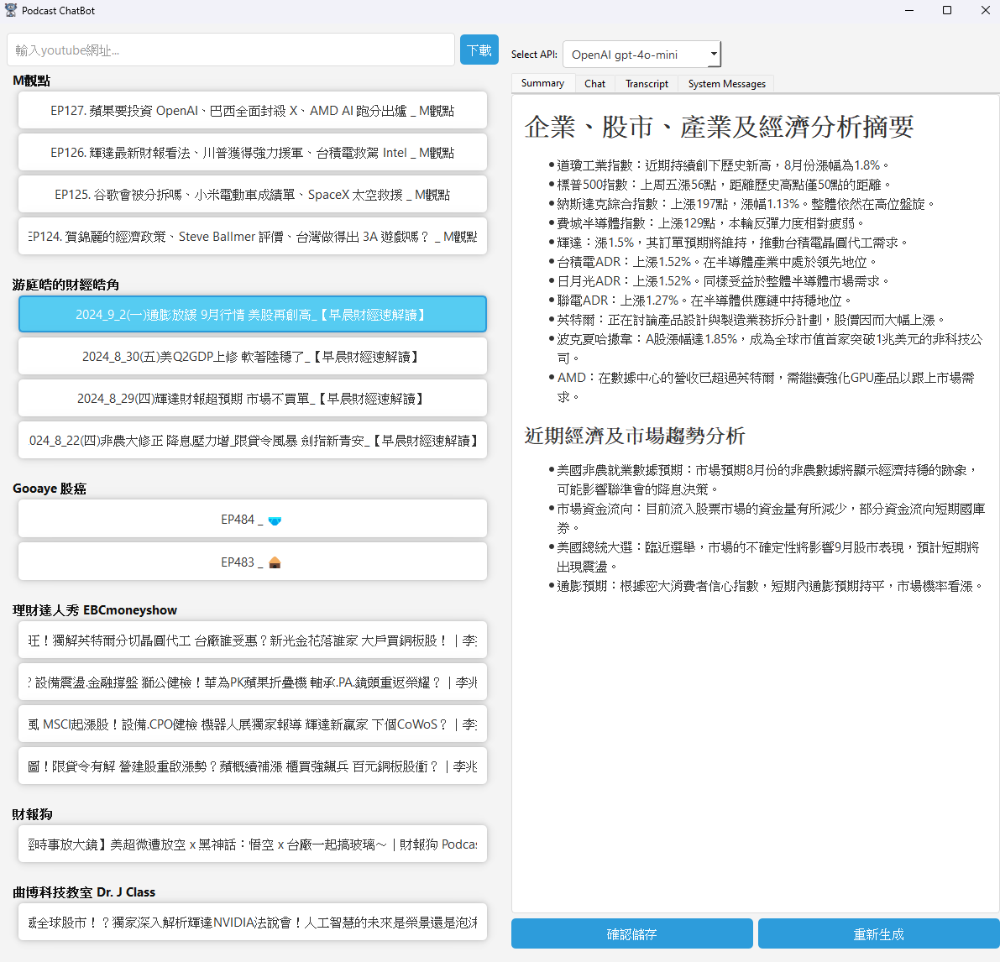
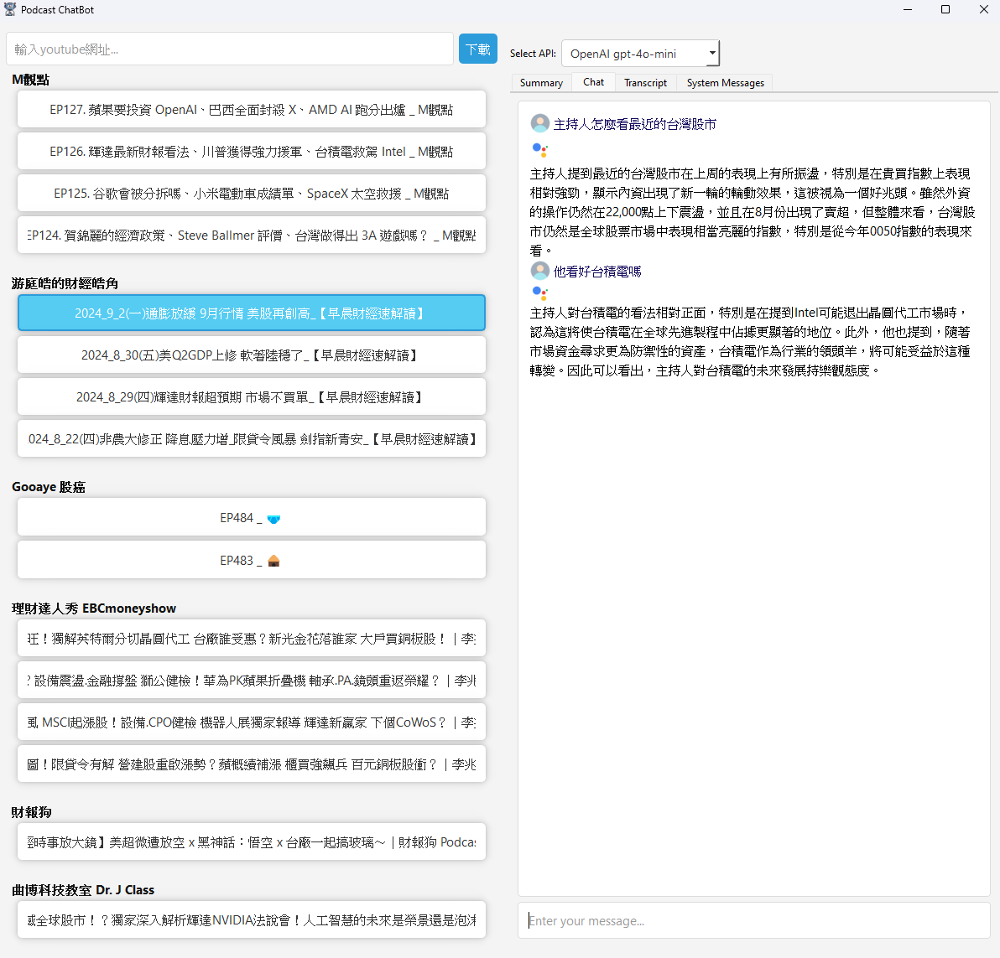

# ChatPod: Chat with YouTube Podcasts and Videos

ChatPod 是一個強大且簡單易用的工具，讓你可以輕鬆掌握 YouTube 內的影片和Podcast 的內容。不僅可以自動下載逐字稿並生成精簡摘要，還能透過互動式聊天介面與內容進行深入交流，支援OPENAI(需申請付費api key)及GROQ(需申請免費api key)。

## 介面截圖

### 看 Podcast 摘要


### 跟 Podcast 內容聊天


## 功能

- 下載 YouTube 頻道或單個影片的逐字稿。
- 支援 Podcast 逐字稿的生成。
- 使用 OpenAI Whisper 將影片或音頻轉換成文字，或下載已有的字幕。
- 自動生成內容摘要，方便快速了解影片或 Podcast 的主要內容。
- 提供圖形化使用者介面 (PyQt5)，讓使用者能選擇逐字稿並與其互動，提問相關問題。

## 技術架構

- `youtube_video_processor.py`：負責下載 YouTube 影片，並使用 OpenAI Whisper 模型生成逐字稿。
- `utils.py`：包含輔助工具函數，包括 API 客戶端初始化、摘要生成和檔案處理等功能。
- `transcript_UI.py`：使用 PyQt5 創建的圖形化介面，用於展示逐字稿和與逐字稿互動。

## 安裝與環境設置

### 前置條件

- Python 3.8 以上版本
- pip 套件管理工具

### 安裝步驟

1. 克隆此專案：
    ```bash
    git clone https://github.com/jacky88927/chatpod.git
    ```
2. 進入專案目錄：
    ```bash
    cd chatpod
    ```
3. 安裝所需依賴：
    ```bash
    pip install -r requirements.txt
    ```

## 使用方式

### 下載內容逐字稿

運行以下命令來處理 YouTube 頻道或單個影片，並生成逐字稿：

```bash
python youtube_video_processor.py channel "https://www.youtube.com/channel/yourchannelurl" --output_dir ./transcriptions
```

或者處理單個影片：

```bash
python youtube_video_processor.py single "https://www.youtube.com/watch?v=yourvideoid" --output_dir ./transcriptions
```

### 啟動 UI 介面

生成逐字稿後，請確保在 `transcript_UI.py` 中將 API 金鑰 (`groq_api_key` 和 `openai_api_key`) 更改為您自己的金鑰。

   - 修改位置：`transcript_UI.py` 檔案中，找到以下代碼片段並替換 `Your groq api key` 和 `Your openai api key` 為您自己的 API 金鑰：
     ```python
     groq_api_key = "Your groq api key"
     openai_api_key = "Your openai api key"
     ```

然後運行以下命令啟動 UI：

```bash
python transcript_UI.py
```

這將啟動圖形化界面，允許使用者選擇逐字稿與之互動，並生成影片的摘要。

## 檔案結構

- `youtube_video_processor.py`：影片下載與轉錄。
- `utils.py`：包含輔助工具，例如 API 初始化、摘要生成、檔案讀取和儲存。
- `transcript_UI.py`：使用者介面。
- `requirements.txt`：所需的 Python 套件。
- `README.md`：專案介紹與使用說明。

## 範例

- 處理 YouTube 頻道影片並生成摘要：
  ```bash
  python youtube_video_processor.py channel "https://www.youtube.com/channel/yourchannelurl" --output_dir ./transcriptions
  ```
- 啟動 UI 與逐字稿進行互動：
  ```bash
  python transcript_UI.py
  ```

## 貢獻

歡迎任何形式的貢獻！請通過 Issue 報告錯誤或提出建議，或提交 Pull Request 以改進代碼。

## 授權

本專案基於 MIT License，詳細信息請參考 LICENSE 文件。
